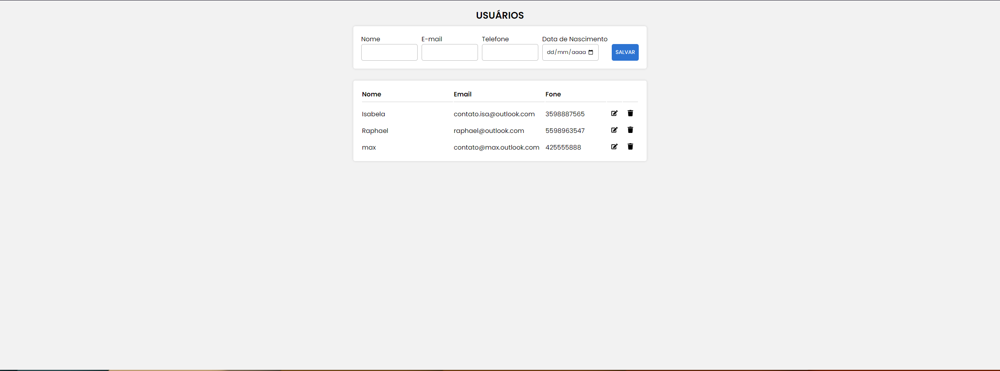

# React-JS--Crud-Mysql

 

  

## Installation

### Client

  1. `$ cd frontend`
  2. `$ npm install` or `$ yarn`
  3. `$ npm start` or `$ yarn start`
  
### Server

  1. Change your mySQL database data `backend\api`
  2. `$ cd api`
  3. `$ npm install` or `$ yarn`
  4. `$ npm start` or `$ yarn start`
  
## Functionalities

  + Create users in the database
  + Read users in the database
  + Update users in the database
  + Delete usres in the database
  + Click to edit and delete users
  
## Used Libraries

### Front-end

 +  `Axios`

### Back-end

+ `express`
+ `mysql`
+ `nodemon`
+ `cors`
